# Linux console,tty,serial学习笔记

wheatfox 2023.12
enkerewpo@hotmail.com

## tty

什么是tty？其全称为Teletypewriter，即电传打字机，其与普通typewriter的区别是，电传打字机将直接发送输入的消息。随着计算机的出现，电传打字机便被用于作为非常方便的输入设备。


*上图为1956 年的 LGP-30 计算机，附带 TTY*

后来电传打印机被抽象化，作为了“虚拟”的tty。那么terminal（终端）和tty之间是什么关系呢？实际上，每个terminal都在和一个虚拟tty（pty）进行交互。


https://www.linusakesson.net/programming/tty/index.php


上面的图给出了tty在软件层方面的一种设计思路，实际上通过tty能够实现line editing, session management等丰富的功能。


上面的两张图片展示了在xterm中运行`cat`和`ls | sort`指令时，各个linux进程和tty等结构的对应关系。

## console与terminal

什么是terminal终端？终端可以理解为是人机交互的界面，终端分为本地终端（如通过VGA连接到显示器外加键盘）、串口终端（通过串口线和串口终端软件对另外的一台机器进行访问）、远程终端（如SSH终端）。

那什么是console控制台呢？在历史上，物理console和terminal是有区别的，物理terminal是人使用的界面，而物理console则只显示操作系统相关的信息。

在linux中，**显示系统消息的terminal即为console**，并且默认认为所有虚拟terminal都可以显示系统消息，都可以是console，**可以说linux中淡化了二者的区别**。注意到，我们使用gnome-terminal打开一个终端的时候，tty指令显示的为`/dev/pts/0`，这里的pts是**pseudo-terminal slave**，是对pty（虚拟tty）的一种SSH实现，要和`/dev/tty*`做区别。


上图是我运行`ps l`的结果，可以注意到，gnome-terminal打开的bash使用了`pts/3`，而Xorg和gdm-x-session则是直接输出到`tty2`。

https://blog.csdn.net/qq_27825451/article/details/101307195

> tty是最令人熟悉的了，在Linux中，/dev/ttyX代表的都是上述的物理终端，其中，/dev/tty1~/dev/tty63代表的是本地终端，也就是接到本机的键盘显示器可以操作的终端。事实上Linux内核在初始化时会生成63个本地终端，通过键盘上的Fn-Alt-FX(X为1,2,3…)可以在这些终端之间切换，每切换到一个终端，该终端就是当前的**焦点终端**，比如说，你按下了Fn-Alt-F4组合键，那么此时第4个终端就是焦点终端，即/dev/tty4就是焦点终端设备。

向`/dev/console`中写入东西的时候，就会出现在**焦点终端**上，除此之外，`/dev/tty`则指向的是当前正在使用的tty。

串口终端则以`ttyS0,ttyS1,...`来命名，即另外一台机器通过串口线连接到本台机器上，在本台机器上访问另外一台机器的终端。

## early console

> printk的log输出是由console实现。由于在kernel刚启动的过程中，还没有为串口等设备等注册console（在device probe阶段实现），此时无法通过正常的console来输出log。为此，linux提供了early console机制，用于实现为设备注册console之前的早期log的输出，对应console也称为boot console，简称bcon。这个console在kernel启动的早期阶段就会被注册，主要通过输出设备（比如串口设备）的简单的write方法直接进行数据打印。而这个write方法也就是平台实现。
> 

## 阅读源码

### include/linux/tty.h

struct tty_struct

部分成员：

1. kref - 当前tty的tty_kref_get()值，即引用数
2. dev - device结构体，如ptys,serdev
3. driver - tty_driver结构体
4. ops - tty_operations结构体
5. index - 当前tty的编号
6. ldisc_sem - line discipline semaphore?（用于保护）
7. ldisc - line discipline行规程
8. atomic_write_lock - 并发写锁（用于保护）
9. legacy_mutex - 历史遗留的成员
10. throttle_mutex - 保护并发tty_throttle_safe()？
11. termios_rwsem - termios读写信号量（用于保护）
12. winsize_mutex - winsize互斥锁（用于保护）
13. termios - 当前tty的终端控制
14. termios_locked - 被锁住的termios？
15. name - 如ttyS3
16. flags - bitwise OR of %TTY_THROTTLED, %TTY_IO_ERROR, ...
17. count - 当前tty打开的进程数
18. winsize - 终端的“窗口”大小
19. flow - 流设置，有一组flow.lock,flow.stopped.flow.tco_stopped,flow.unused
20. ctrl - 控制设置
    1. ctrl.lock
    2. ctrl.pgrp - 当前tty的进程组
    3. ctrl.session - 当前tty的session
    4. ctrl.pktstatus
    5. ctrl.packet
    6. ctrl.unused
21. link - 链接到pty
22. disc_data - ldisc的私有数据
23. driver_data - driver的私有数据
24. tty_files - list of (re)openers of this tty (i.e. linked &struct tty_file_private)？tty打开的文件的列表
25. write_buf - temporary buffer used during tty_write() to copy user data to
26. write_cnt - count of bytes written in tty_write() to @write_buf

### include/linux/tty_driver.h

The usual handling of &struct `tty_driver` is to allocate it by `tty_alloc_driver()`, set up all the necessary members, and register it by `tty_register_driver()`. At last, the driver is torn down by calling `tty_unregister_driver()` followed by `tty_driver_kref_put()`.

### include/linux/console.h

struct consw - consoles的回调函数集合

1. con_startup
2. con_init
3. con_clear
4. con_putc
5. con_putcs
6. con_cursor
7. con_scroll
8. con_font_set
9. con_resize
10. con_set_palette
11. ...

struct console - 核心的console结构

成员：

1. name - console driver的名字
2. write: - write回调函数
3. read - read回调函数
4. device - tty device driver回调函数
5. unblank - unblank回调函数
6. setup - console初始化回调函数
7. exit - console退出回调函数
8. match - match回调函数？
9. flags - cons_flags
10. index - console编号
11. cflag - TTY control mode flags
12. ispeed - TTY input speed
13. ospeed - TTY output speed
14. seq -Sequence number of the next ringbuffer record to print
15. dropped -Number of unreported dropped ringbuffer records
16. data - Driver private data
17. node - hlist node for the console list
18. write_atomic - Write callback for atomic context
19. nbcon_state - State for nbcon consoles
20. nbcon_seq - Sequence number of the next record for nbcon to print
21. pbufs - Pointer to nbcon private buffer

头文件里重要函数

`extern void register_console(struct console *);`

该函数的定义是在`kernel/printk/printk.c`中，其函数注释如下：

The console driver calls this routine during kernel initialization to register the console printing procedure with printk() and to print any messages that were printed by the kernel before the console driver was initialized. This can happen pretty early during the boot process (because of early_printk) - sometimes before setup_arch() completes - be careful of what kernel features are used - they may not be initialised yet. There are two types of consoles - bootconsoles (early_printk) and "real" consoles (everything which is not a bootconsole) which are handled differently. Any number of bootconsoles can be registered at any time. As soon as a "real" console is registered, all bootconsoles will be unregistered automatically. Once a "real" console is registered, any attempt to register a bootconsoles will be rejected.

这个控制台驱动程序在内核初始化期间调用此例程，用于使用printk()注册控制台打印过程，并打印在控制台驱动程序初始化之前内核打印的任何消息。这可能发生在引导过程的相当早期阶段（因为有early_printk），有时甚至在setup_arch()完成之前，要小心使用了哪些内核特性，它们可能尚未初始化。有两种类型的控制台 - 引导控制台（early_printk）和“真实”控制台（不是引导控制台的所有内容），它们被不同地处理。**可以随时注册任意数量的引导控制台（boot consoles）。一旦注册了“真实”控制台，所有引导控制台将自动取消注册。**一旦注册了“真实”控制台，任何尝试注册引导控制台的操作都将被拒绝。

### include/linux/device.h

struct device - linux中对设备的描述结构

## dts注册serial

下面的内容来自龙芯的2K1000板子的dts文件loongson2k1000.dtsi。

```c
aliases {
    serial0 = &cpu_uart0;
    serial1 = &uart1;
    ...
};
soc {
    ...
    cpu_uart0: serial@0x1fe20000 {
        compatible = "ns16550a";
        pinctrl-names = "default";
        pinctrl-0 = <&uart0_4_default>;
        reg = <0 0x1fe20000 0 0x10>;
        clocks = <&clks CLK_UART>;
        interrupt-parent = <&icu>;
        interrupts = <0>;
        no-loopback-test;
        status = "okay";
    };
    ...
}
```

linux通过dts文件编译得到的dtb文件进行硬件设备树的配置。

device tree中关于serial部分的文档

https://www.kernel.org/doc/Documentation/devicetree/bindings/serial/serial.txt

https://en.ica123.com/device-tree-parsing-during-kernel-boot/

linux首先进行设备树解析？

start_kernel()

setup_arch()

unflatten_device_tree()

之后读取串口驱动（driver/tty/serial目录下包含串口驱动），之后对相对应的串口进行初始化

驱动代码调用register_console函数，实现console注册

通过console_setup函数配置console

之前在自制rootfs时，在dev目录下进行了mknode操作

```bash
mknod console c 5 1
```

其中c代表character device, 5是主设备号，1是第一个子设备，这样就创建了/dev/console设备

# 探究linux kernel启动流程

搞清楚aarch64下linux从entry开始到注册实际console的调用过程，以及linux kernel如何读取硬件dtb，并读出serial相关信息。

这里使用linux kernel 6.6.8的源码进行阅读


# NXP板子研究笔记

启动扳子，连接DEBUG到电脑，我这里默认连接到的串口tty为/dev/ttyACM0

使用gtkterm打开NXP板子的串口终端


默认启动的是自带的linux 5.4.70，通过查看启动拨码开关，默认是配置为eMMC启动。

## NXP jailhouse

https://github.com/nxp-imx/imx-jailhouse

i.MX Jaihouse Hypervisor

```bash
cd imx-jailhouse
cd ci
wget http://www.kiszka.org/downloads/jailhouse-ci/kernel-build.tar.xz
tar xJf kernel-build.tar.xz
cd .. # enter root dir of imx-jailhouse
```

由于我们只需要aarch64的target，修改build-all-configs.sh

```
CONFIGS="amd-seattle"
...
make KDIR=ci/linux/build-$CONFIG ARCH=$ARCH \
     CROSS_COMPILE=$CROSS_COMPILE clean 去掉clean
->
make KDIR=ci/linux/build-$CONFIG ARCH=$ARCH \
	     CROSS_COMPILE=$CROSS_COMPILE
```

之后运行

```
./ci/build-all-configs.sh
```

可以发现编译得到了

```bash
imx-jailhouse/driver/jailhouse.ko # kernel module
jailhouse.ko: ELF 64-bit LSB relocatable, ARM aarch64, version 1 (SYSV), BuildID[sha1]=459e049bd217f3160316f7d5c0ef3fdda618db38, not stripped

imx-jailhouse/tools/jailhouse # 可执行文件
jailhouse: ELF 64-bit LSB executable, ARM aarch64, version 1 (SYSV), dynamically linked, interpreter /lib/ld-linux-aarch64.so.1, BuildID[sha1]=196d6db5c30a4524323ca77e3584743161fa96e3, for GNU/Linux 3.7.0, with debug_info, not stripped

imx-jailhouse/configs/arm64下生成的cell文件和dtb文件

imx-jailhouse/tools/jailhouse-* # 工具脚本文件
```

写一个脚本把这些文件专门整理好：

```bash
rm -rf export
mkdir export
cp driver/jailhouse.ko export/jailhouse.ko
cp tools/jailhouse export/jailhouse
```

试着把生成的文件在nxp板子上运行，出现glibc问题


检查一下板子自带系统的glibc版本：


果然版本太低了，试着编译一个glibc-2.34版本的放在板子上。


然后configure的时候发现板子上缺少linux的headers

https://github.com/OK8MQ-linux-sdk/OK8MQ-linux-sdk

这个问题可以通过使用NXP提供的编译器以及环境来解决，从上面的URL中下载aarch64-poky-linux工具链并解压安装

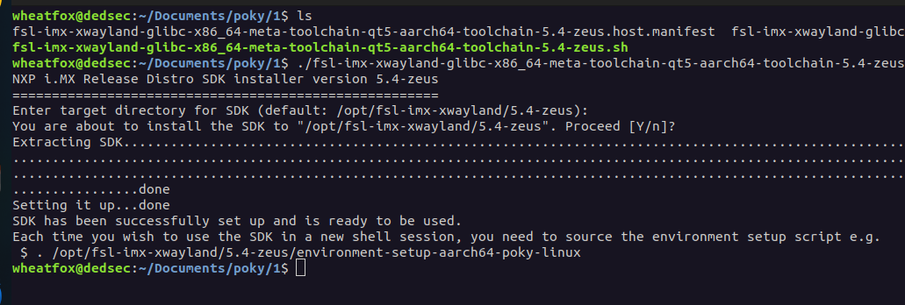

```bash
Each time you wish to use the SDK in a new shell session, you need to source the environment setup script e.g.
. /opt/fsl-imx-xwayland/5.4-zeus/environment-setup-aarch64-poky-linux
```

SDK源码包，包括linux kernel, 文件系统等 https://github.com/Comet959/-ok8mq-jailhouse-linux/releases/tag/v1.0.0

aarch64-poky-linux-gcc "stdio.h" not found https://blog.iotot.com/?p=346

由于之前是直接下载的linux-kernel build，那个build是使用aarch64-gnu-linux-gcc编译的，和这一套aarch64-poky工具链还是有区别的，所有我重新执行了

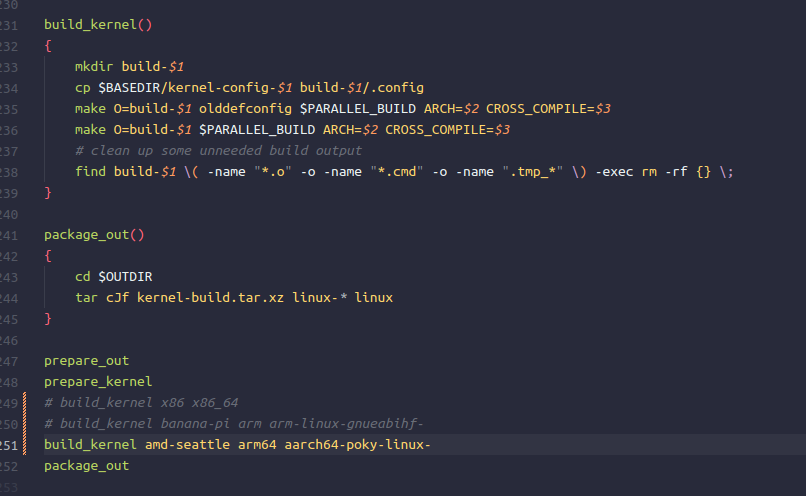

```bash
./ci/gen-kernel-build.sh
```

使用aarch64-poky工具链编译linux kernel 5.10

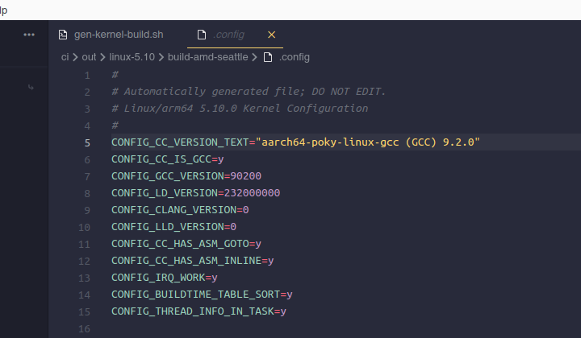

之后重新编译jailhouse，需要注意此时aarch64-poky的脚本依然生效，所以没有指定ARCH等变量

```bash
make KDIR=ci/out/linux/build-amd-seattle
```

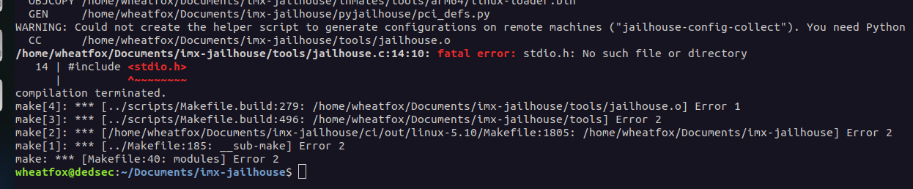

依然找不到stdio.h，原因还是因为编译jailhouse的之后没有指定好sysroot，即使初始化脚本里设置了CC的sysroot，但是jailhouse编译的时候猜测并没有成功传入这个参数

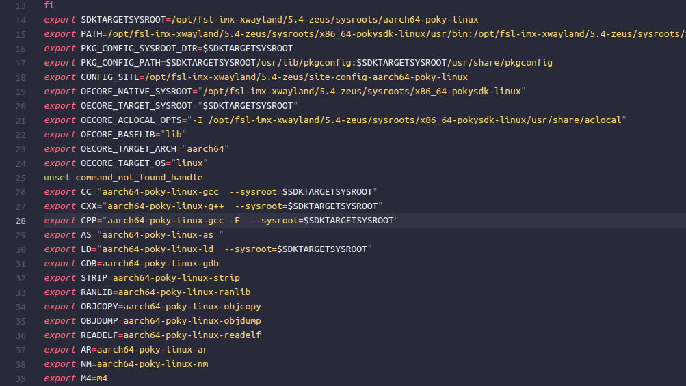

检查发现hypervisor目录下的源代码都成功生成了object文件，而stdio.h是tools下的源码使用的，尝试修改tools/Makefile

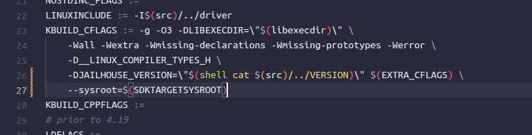

在KBUILD_CFLAGS中加一行，--sysroot指向aarch64-poky环境变量

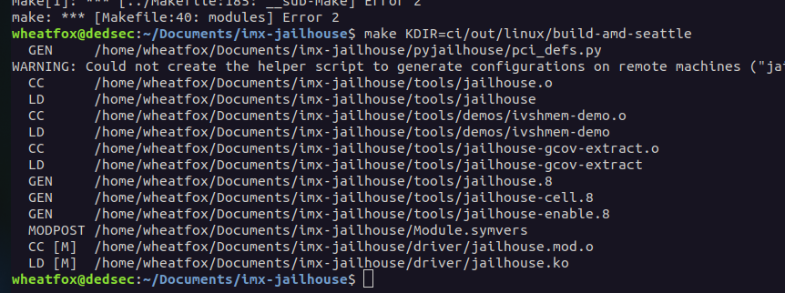

成功编译了jailhouse可执行程序和jailhouse.ko，上板运行

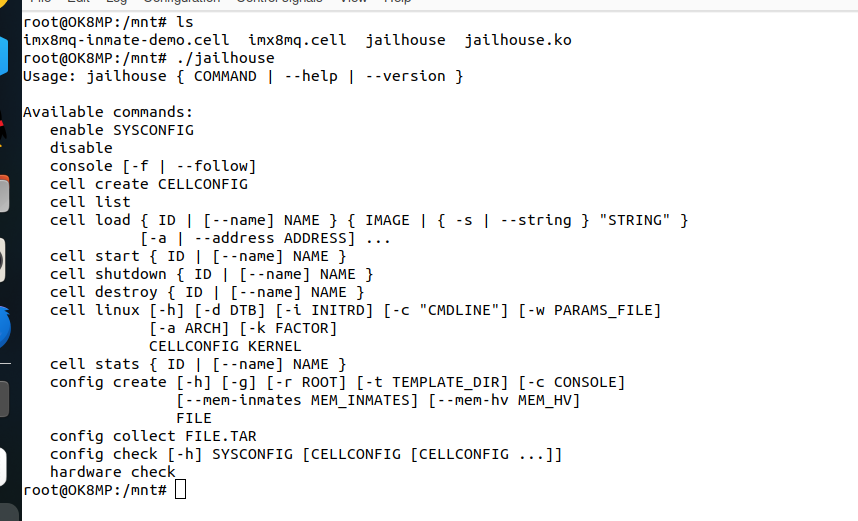

jailhouse工具成功启动，但是添加内核模块的时候报错 invalid module format

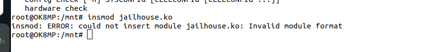

```bash
Linux OK8MP 5.4.70-2.3.0 #1 SMP PREEMPT Mon Apr 10 01:43:43 UTC 2023 aarch64 aarch64 aarch64 GNU/Linux
```

刚才通过jailhouse的ci脚本编译的的是linux 5.10的内核，猜测是因为用的linux源码版本不对

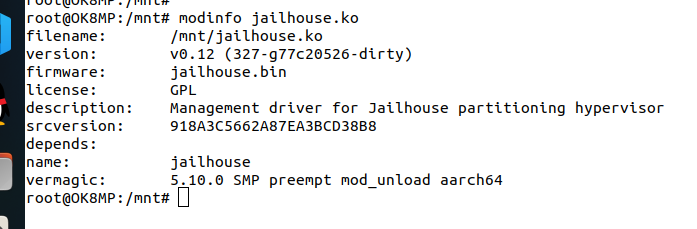

模块加载时 insmod “Invalid module format ”问题解决 https://blog.csdn.net/ymangu666/article/details/22872439

> 内核无法加载模块的原因是因为记载版本号的字符串和当前正在运行的内核模块的不一样，这个版本印戳作为一个静态的字符串存在于内核模块中，叫vermagic

而手头的NXP板子是5.4的系统。

接下来的目标就明确了，即在 https://github.com/Comet959/-ok8mq-jailhouse-linux/releases/tag/v1.0.0 下载厂家给的linux源码。

下载好之后放在opt目录，对应的linux-kernel源码目录位于`/opt/OK8MQ-linux-sdk/OK8MQ-linux-kernel`

出现报错

````
usr/bin/ld: scripts/dtc/dtc-parser.tab.o:(.bss+0x10): multiple definition of 'yylloc'; scripts/dtc/dtc-lexer.lex.o:(.bss+0x0): first defined here
````

查到的解决方法：

```
vim scripts/dtc/dtc-lexer.lex.c +640
    extern YYLTYPE yylloc;
```

在IMX的SDK下编写build.sh

```bash
cd ./OK8MQ-linux-kernel
make -j16 imx_v8_defconfig
make -j16
```

这样在jailhouse编译的时候使用:

```bash
make KDIR=/opt/OK8MQ-linux-sdk/OK8MQ-linux-kernel
```

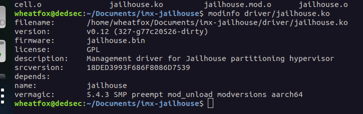

编译出来了面向linux 5.4内核的jailhouse.ko,上板试一下

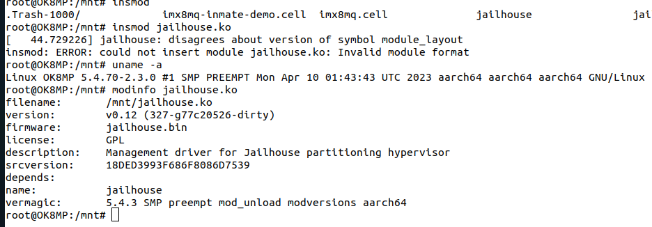

还是报错,可以看到虽然都是5.4,但是和我目前板子运行的linux版本还是有区别的,注意到jailhouse本身也报了一个错是disagrees about version of symbol module_layout

和当前板子上的kernel module对比:

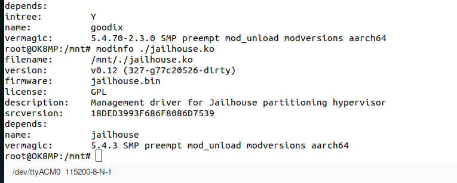

```bash
5.4.70-2.3.0 SMP preempt mod_unload modversions aarch64 # goodix
5.4.3 SMP preempt mod_unload modversions aarch64 # jailhouse
```

所以目前这份厂家提供的linux源码版本并不对,需要再向厂商要板子的linux 5.4.70源码.

目前在向厂家要了，在29号拿到了下载权限

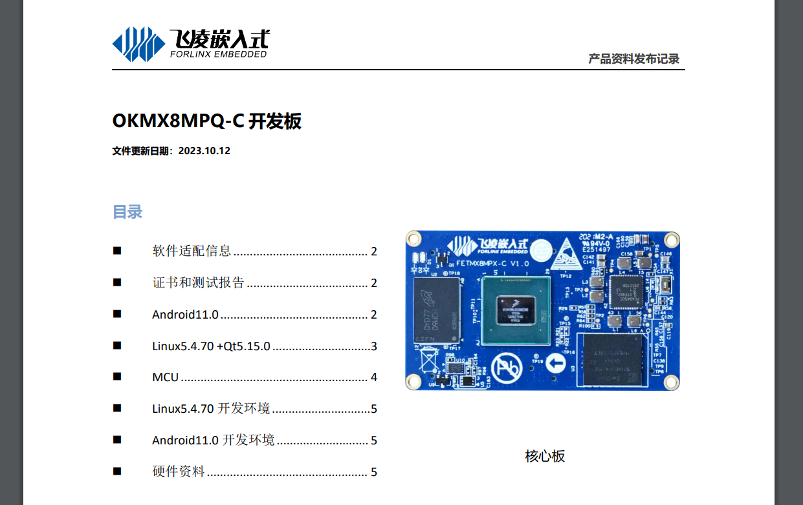

可以看到当前这版资料这里的linux内核和板子上的版本一致。

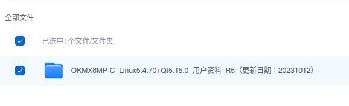

在下载这个版本的SDK后，我发现其根目录有一个build.sh

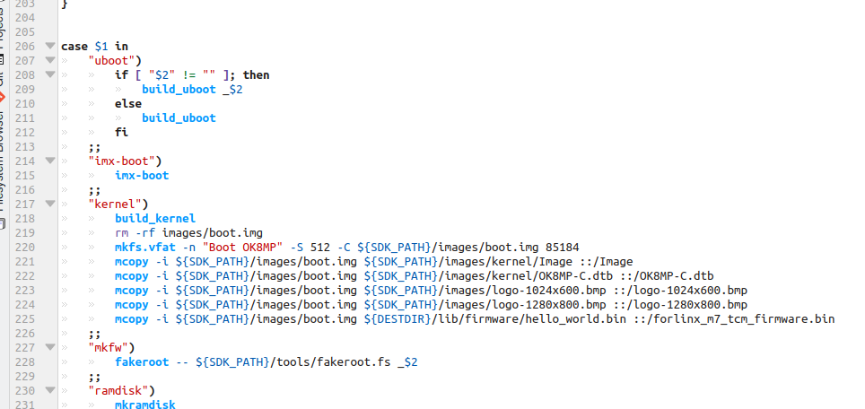

试着用这个脚本编译IMX linux kernel 5.4.70

```
. /opt/fsl-imx-xwayland/5.4-zeus/environment-setup-aarch64-poky-linux
./build.sh kernel
```

需要注意的是，我修改了build.sh，配置`MAKE_JOBS=8`，因为如果设置为16的话，会导致我的ubuntu直接死机，之前编译内核的之后没有出现过这种问题，所以我还是减少了并行编译的线程数。

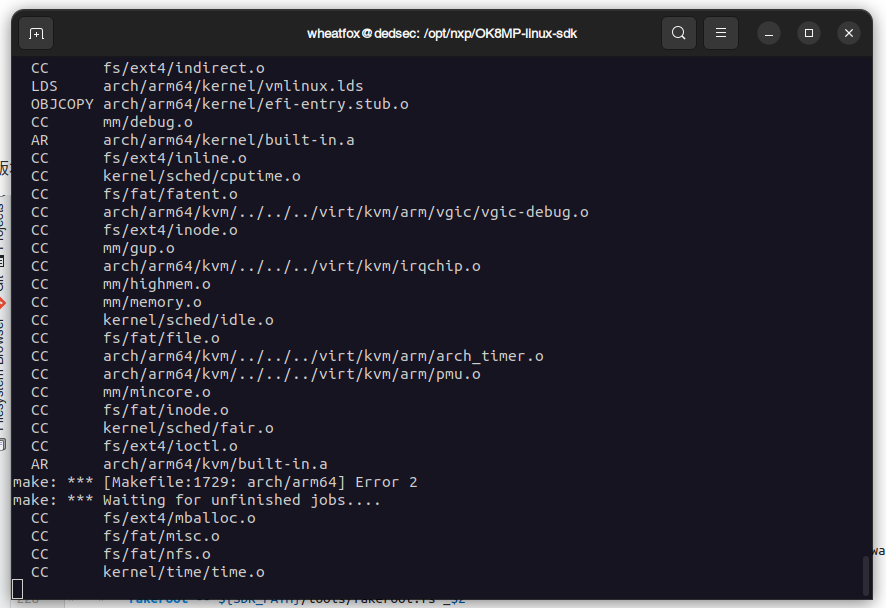

我突然发现这个脚本甚至把jailhouse也编译了，也就算说这个SDK里是有jailhouse的源码的……

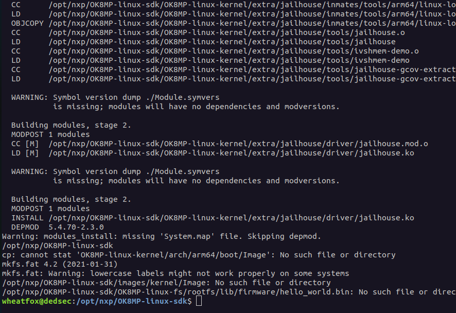

位于OK8MP-linux-kernel/extra/jailhouse，这下方便了许多，并且能够保证jailhouse.ko的版本和内核一致。（但是看起来内核本身的编译没有成功，之后要看一下）

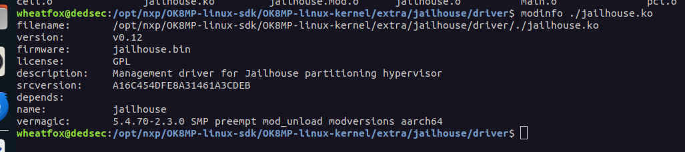

这里的vermagic终于对上了

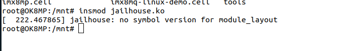

上板成功加载module

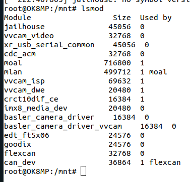

/dev下会多一个jailhouse设备

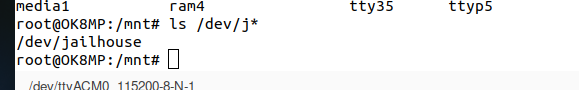

接下来就是在板子上试一下jailhouse

```bash
./jailhouse enable ../imx8mp.cell
```

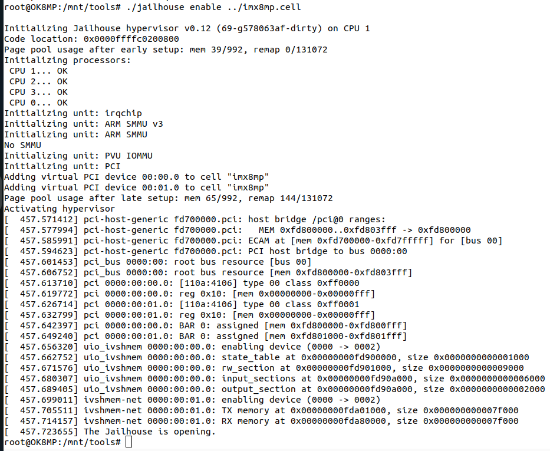

成功配置了默认的板卡配置文件im8mp.cell，可以看到4个CPU都被识别到了。

```bash
./jailhouse cell create ../imx8mp-gic-demo.cell
```

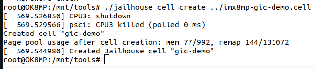

开启gic-demo配置后，CPU3被关闭，查看cell list

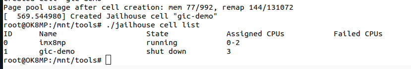

这里gic-demo被分配到了单独的CPU3上，还没有开始运行

```bash
./jailhouse cell start --name gic-demo
```

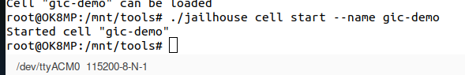

接下来试着启动一个non-root linux cell

准备好kernel和ramdisk

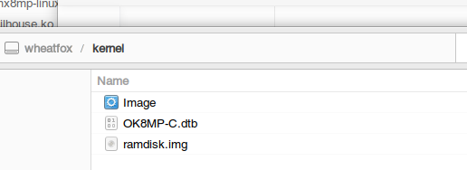


```bash
./tools/jailhouse cell linux ./imx8mp-linux-demo.cell ./kernel/Image -i ./kernel/ramdisk.img
```

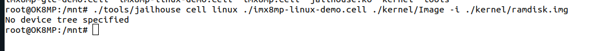

看起来必须传入dtb文件

```bash
./tools/jailhouse cell linux ./imx8mp-linux-demo.cell ./kernel/Image --initrd ./kernel/ramdisk.img --dtb ./kernel/OK8MP-C.dtb
```

报错：

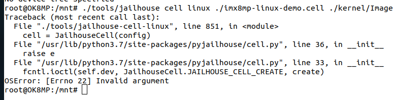


可以看到是`fcntl.ioctl(self.dev, JailhouseCell.JAILHOUSE_CELL_CREATE, create)`出现了问题，报错OSError no.22

首先这段代码将self.dev指向了打开的/dev/jailhouse文件，之后执行了fcntl.ioctl，这里是执行了一个系统调用ioctl

https://docs.python.org/zh-cn/3/library/fcntl.html

https://manpages.debian.org/ioctl(2)

> The **ioctl**() system call manipulates the underlying device parameters of special files. In particular, many operating characteristics of character special files (e.g., terminals) may be controlled with **ioctl**() requests. The argument *fd* must be an open file descriptor.

fcntl.**ioctl**(*fd*, *request*, *arg=0*, *mutate_flag=True*)

fd为文件描述符，request是一个termios参数（https://docs.python.org/zh-cn/3/library/termios.html#module-termios），arg指向一个buffer，ioctl可以理解为对一个device进行操作。怀疑是/dev/jailhouse没有权限写？

```
chmod 777 /dev/jailhouse
```

依然报错`OSError: [Errno 22] Invalid argument`

Error when testing linux on jailhouse https://groups.google.com/g/jailhouse-dev/c/WaSMOYB_XQ4/m/Kp62ClTpCgAJ

https://www.mail-archive.com/jailhouse-dev@googlegroups.com/msg07264.html

```bash
vi /usr/lib/python3.7/site-packages/pyjailhouse/cell.py
```

```bash
insmod jailhouse.ko
./tools/jailhouse enable ./imx8mp.cell
./tools/jailhouse cell linux ./imx8mp-linux-demo.cell ./kernel/Image --initrd ./kernel/ramdisk.img --dtb ./kernel/OK8MP-C.dtb
```

问题解决，应该首先使用enable启动jailhouse！

此时出现新的报错：

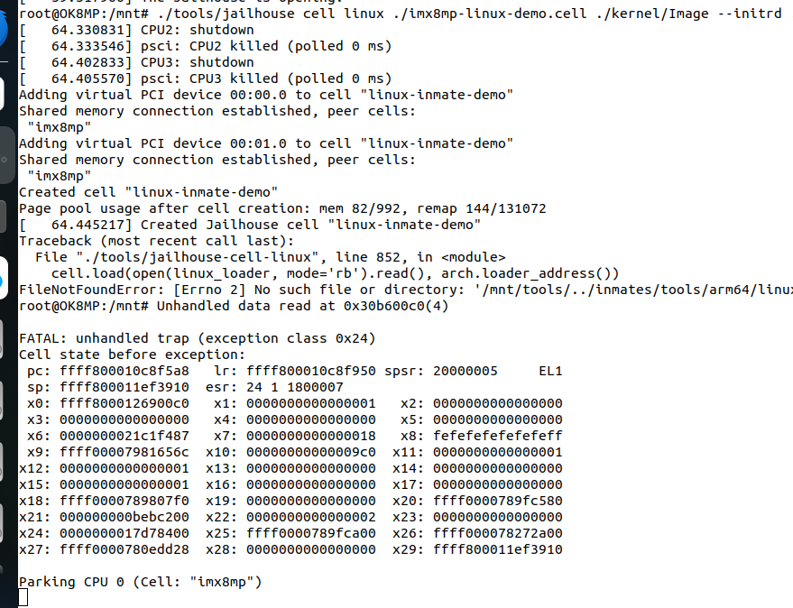

可以看到linux-inmate-demo cell是成功创建了，但是：

```
FileNotFoundError: [Errno 2] No such file or directory: '/mnt/tools/../inmates/tools/arm64/linux-loader.bin'
```

jailhouse在/mnt目录下寻找`inmates/tools/arm64/linux-loader.bin`，但是我U盘里并没有这个文件。

然后板子就死机了：

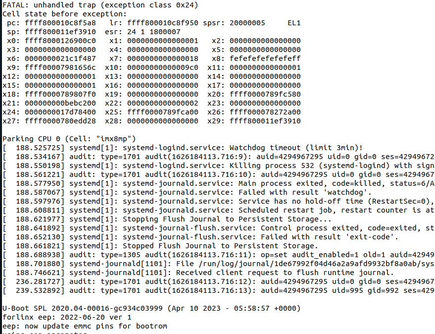

```bash
insmod jailhouse.ko
./tools/jailhouse enable ./imx8mp.cell
./tools/jailhouse cell linux \
	./imx8mp-linux-demo.cell \
	./kernel/Image \
	--initrd ./kernel/ramdisk.img \
	--dtb ./kernel/OK8MP-C.dtb
```

我在jailhouse源码里找到了这个目录

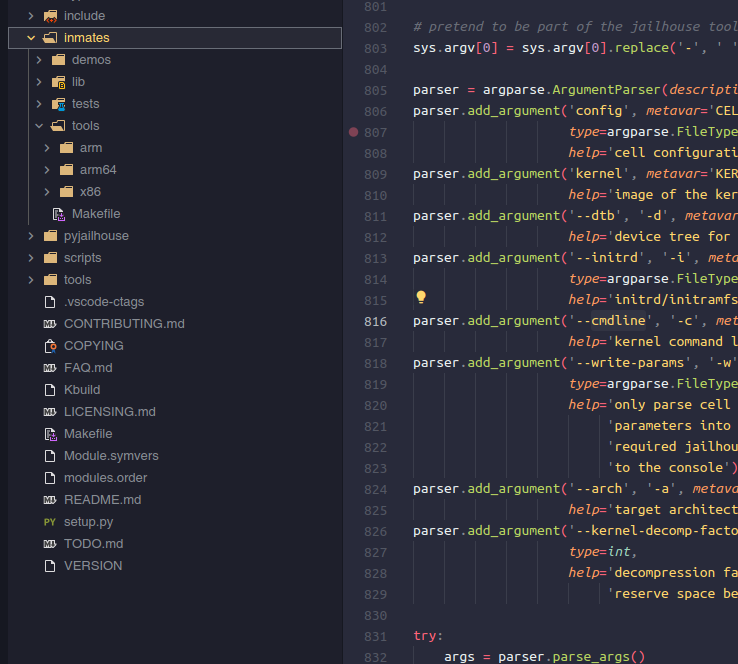

之后没有报错了，但是好像输出并没有打印出来：

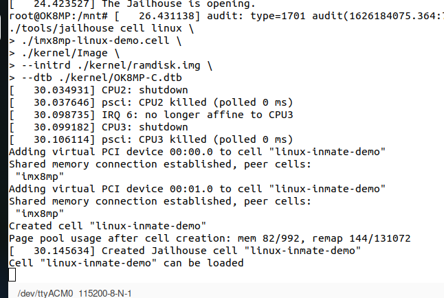

```bash
mount /dev/sda1 /mnt && cd /mnt
insmod jailhouse.ko
./tools/jailhouse enable ./imx8mp.cell
./tools/jailhouse cell linux \
	./imx8mp-linux-demo.cell \
	./kernel/Image \
	-i ./kernel/ramdisk.img \
	-d ./kernel/OK8MP-C.dtb \
	-c "console=ttymxc1,30890000,115200 earlycon=ttymxc1,0x30890000,115200"
```

查看一下板子的串口位置：

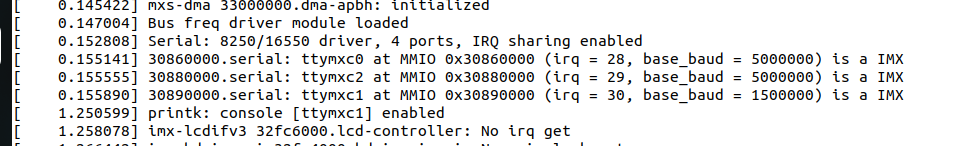

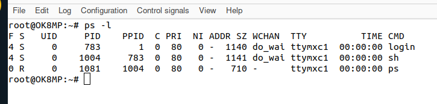

可以看到板子默认使用的是ttymxc1，无论是console还是用户程序都往这个串口输出，通过USB线连接到我的ubuntu的/dev/ttyACM0外部tty。

non-root linux没输出的问题待解决！
